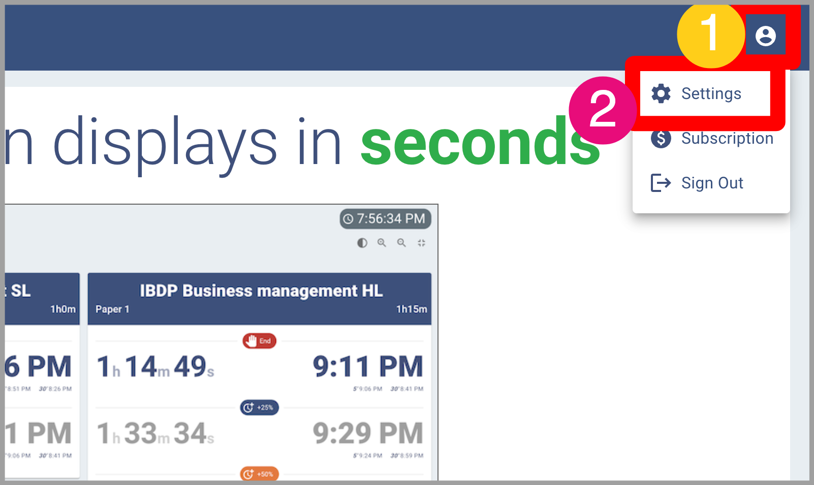
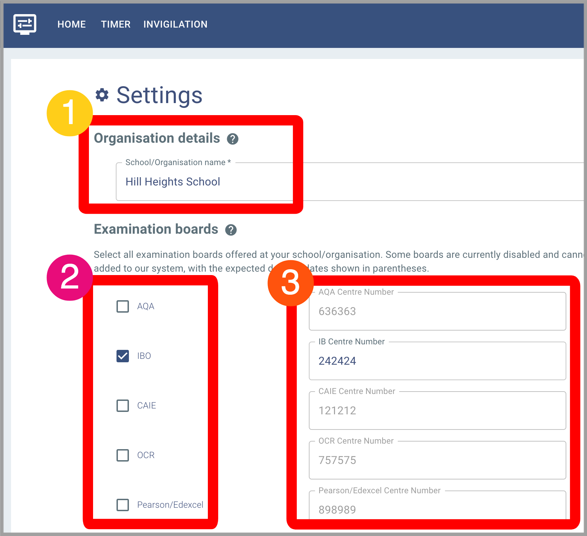
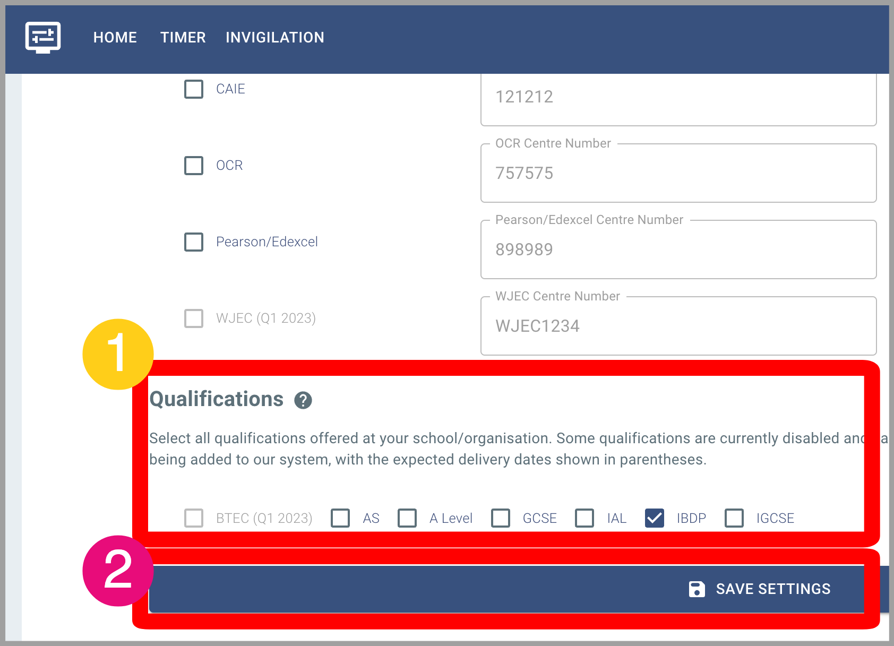
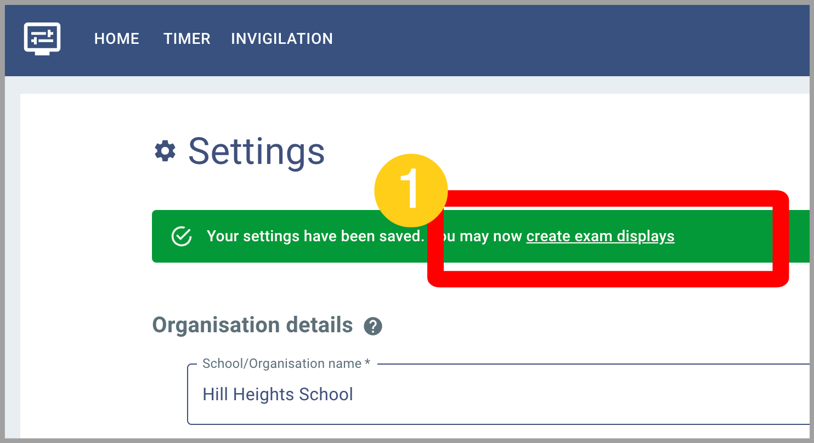
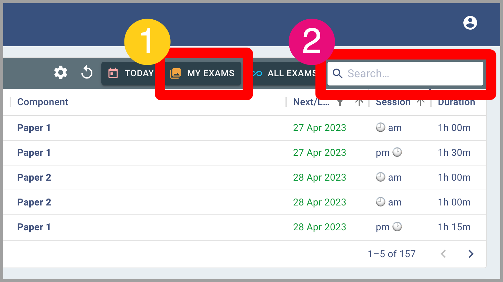
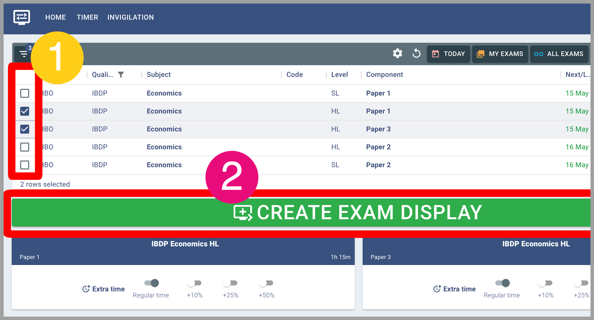
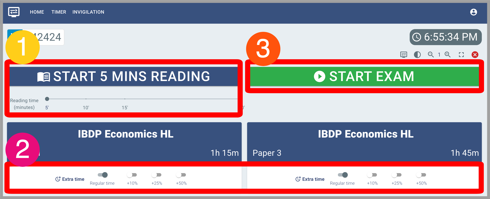
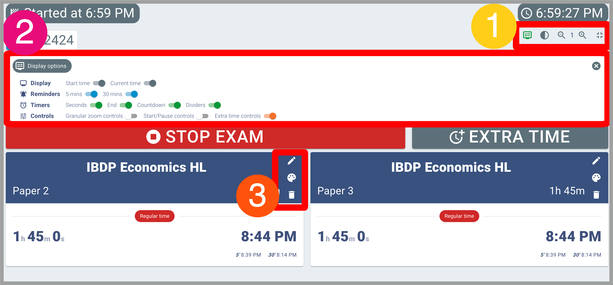
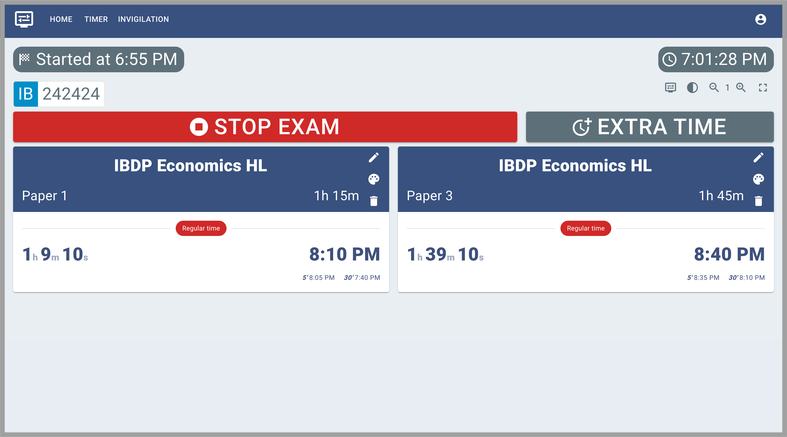

# Quick start

## Visit Settings page
1. Click on the 'Account' icon
2. Click on 'Settings'

## Organisation settings
1. Add your school/organisation name. *This is vital for the system to work properly*
2. Select all of the examination boards offered at your organisation
3. Add the centre numbers for each examination board. 

## Edit qualifications
1. Select all qualifications offered at your organisation. 
2. Click 'Save settings'

## Create exam displays
1. Click on 'Create exam displays'

Alternatively, you can click on 'Invigilation', in the top menu

## Find examination papers
1. Click on 'My exams' (you can also try the two other buttons!)
2. Type keyword(s) in the 'Search' box, to find the examination papers you are looking for

ℹ️ You can search using any part of the examination paper: exam board, subject name, paper name, etc.

## Select examination papers
1. Click on the relevant checkboxes to select/deselect examination papers (you can select as many as you want)
2. Click on 'Create exam display'

## Start exam
1. Optional: Select reading time length, and click the 'Start n mins reading' button
2. Optional: For each exam, select extra time, as needed
3. When ready, click 'Start exam'

## Customise the display
ℹ️ Optional step

You may customise the display. Please see below for icons and their meaning:

Group 1: Display options: show/hide 'Display options panel'

Group 2: 

Group 3: 

## Enjoy ExamDisplay
Let the clock(s) run. 

On time's up, click on 'Stop exam'

